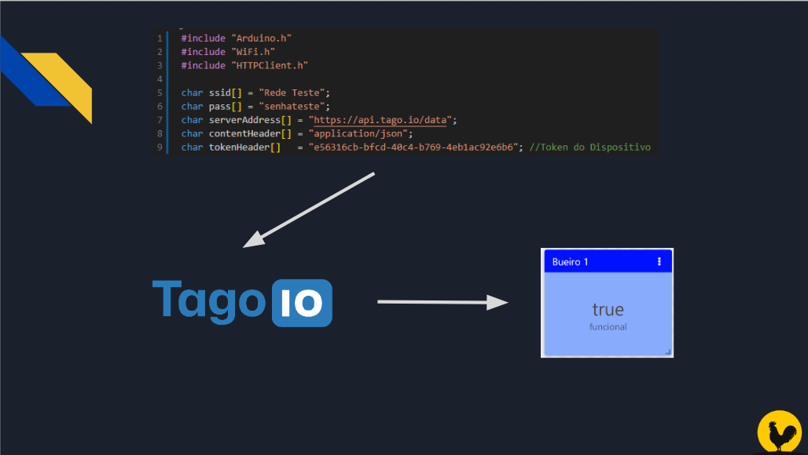

## Desenvolvimento e Entrega da Sprint 3 - Edge Computing and Computer Systems - Challenge 2023 :rooster:

**Nomes + RM dos integrantes:**
- Guilherme Akio - 98582
- Matheus Motta - 550352
- Guilherme Morais - 551981
- Fabrício Saavedra - 97631	
- Vinicius Buzato - 99125

**Turma:** 1ESPW

**Ano:** 2023
___

### Descrição do Projeto
ApNa terceira sprint da challenge proposta pela IBM, na matéria de Edge Computing & Computer Systems, nosso foco foi em integrar os circuitos e sistemas físicos apresentados com a internet, através dos conceitos de internet das coisas (internet of things). 

Dessa forma, os dados coletados pelos sensores ficarão armazenados online, o que viabiliza uma série de novas interações e tratamentos possíveis para esses dados, tornando o projeto mais dinâmico e funcional na prevenção de alerta de ocorrência de alagamentos nos centros urbanos.
___
### Desenvolvimento do projeto
Esta etapa do projeto foi desenvolvida a partir do circuito e sistemas já apresentados [neste repositório](https://github.com/Edge-Computing-1ESPW-Grupo-6/EdgeComputingComputerSystems_Sprint2), com a inclusão de conectividade com a internet e a integração com uma plataforma IoT gratuita que atendesse as necessidades do projeto, a [TagoIO](https://tago.io). 

O objetivo foi fazer com que os dados obtidos através das leituras realizadsa pelo sensor físico fossem enviadas para a internet e armazenadas na plataforma Tago, podendo assim ser manuseadas e analisadas conforme necessário. Para isso, foi preciso fazer um ajuste na componetização do circuito, visto que a placa utilizada do Arduino não apresentava possibilidades de conectividade com a internet. Ela foi então substituida por uma placa modelo [ESP32](https://www.espressif.com/en/products/socs/esp32), que possui conectividade Bluetooth e WiFi, e fizemos os respectivos ajustes nos códigos para que esta funcionasse adequadamente.
___
### Funcionamento do projeto
O funcionamento do projeto na prática segue os mesmos passos do outro repositório já mencionado. Porém, ao fazer a letiura constante do espaço onde se encontra instalado (passo 2 do funcionamento apresentado), o programa realiza as seguintes ações::
1. A leitura feita pelo sensor é enviada para a plataforma Tago através de comandos específicos no [código](Codigo_Arduino.ino) do programa arduino, que levam em conta o endereço WEB da plataforma tago bem como o código token de um dispositivo virtual criado na plataforma, para que a leitura possa ser armazenada nas variáveis desse dispositivo.
2. Essas leituras e suas respecitvas variáveis são apresentadas em forma de um dashboard-display, função já inclusa na plataforma Tago, indicando o estado atual do bueiro verificado (se está obstruido ou não)
    - O sistema também envia a localização da leitura realizada pois, em caso de não funcionamento adequado do bueiro, é possível já informar as auoridades responsáveis da localização exata do problema identificado para que possam tomar medidas preventivas adequadas.

___
### Como executar o projeto
  Para executar o projeto serão necessários:
  - Arduino (juntamente com o código presente [neste arquivo](Codigo_Arduino.ino) - anexa também sua [versão em txt](Codigo_Arduino.txt))
  - Plataforma [TagoIO](https://tago.io) - Para estabelecer a estrutura online do sistema IoI aqui desenvolvido - bem como conhecimento básico sobre seu funcionamento e sobre os conceitos de IoT.
  
E também será necessário um kit básico de componentes físicos do Arduino, dos quais serão utilizados:
<table>
  <tr>
    <td><b>Componente</b></td>
    <td align=center><b>Quantidade</b></td>
  </tr>
    <tr>
    <td>Placa ESP32*</td>
    <td align=center>1</td>
  </tr>
  <tr>
    <td>Sensor de distância ultrassonico</td>
    <td align=center>1</td>
  </tr>
  <tr>
    <td>Cabos jumpers</td>
    <td align=center>-</td>
  </tr>
</table>

Para a montagem do circuito, é necessária fazer a ligação do seansor de distância na placa ESP32 de forma adequada, e conectar a placa em uma porta USB de um computador. Para execução, basta inserir o [código de execução](Codigo_Arduino.ino) no programa Arduino IDe e fazer o upload.

<strong>Atenção:</strong> é necessário um aparelho de roteamento de conexão WiFi por perto, bem como ajustar as linhas 5 e 6 do código com o nome e senha da rede fornecida pelo aparalho, de modo que a placa ESP32 consiga se conectar com a internet e enviar os dados para a plataforma.

*A placa ESP32 não é inclusa em kits básicos do arduino e deve ser adquirida a parte. A conexão de outros componentes com a placa deve ser feita corretamente levando-se em conta cada tipo de pino presente na placa. É possível utilizar [esta referência](./imgs/ESP32-Pinout.jpg) para auxílio na montagem.
___
### Pré-requisitos
Para execução do projeto é necessária experiência com o uso do programa Arduino e de seus componentes físicos, conhecimento básico da linguagem C++ para entendimento do código e ajustes necesários, conhecimento básico dos conceitos de IoT e conhecimento básico de usos da plataforma Tago
___
### Links relacionados
  [Vídeo Explicativo do Projeto](https://drive.google.com/file/d/1NT0kRLj3ujjGDca761uYHHcC2xtsm34h/view?usp=sharing)
