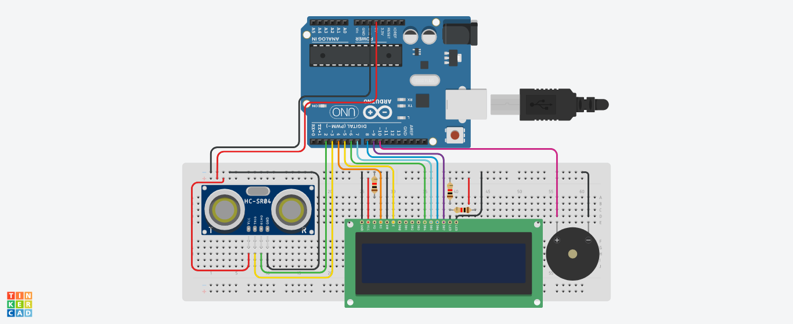

## Desenvolvimento e Entrega da Sprint 2 - Edge Computing and Computer Systems - Challenge 2023 :rooster:

**Nomes + RM dos integrantes:**
- Guilherme Akio - 98582
- Matheus Motta - 550352
- Guilherme Morais - 551981
- Fabrício Saavedra - 97631	
- Vinicius Buzato - 99125

**Turma:** 1ESPW

**Ano:** 2023
___

### Descrição do Projeto
Após a apresentação da primeira sprint, contento a ideia base do circuito de hardware do nosso projeto para a Challenge 2023, proposta pela IBM, nesta segunda sprint fizemos a montagem prática do circuito em ambiente de testagem para replicação em ambiente físico. O circuito se trata de um sensor de proximidade idealizado para ser instalado em bueiros de ruas com o objetivo de detectar objetos e detritos que venham a ficar presos na entreda do bueiro, indicando assim a sua obstrução.

Dessa forma, será possível, através dos alertas emitidos pelo sensor, identificar quais bueiros precisam de manutenção para evitar, ou mesmo minimizar, a ocorrência de enchentes e alagamentos na região. Além disso, será possível priorizar entre diversos bueiros que estejam emitindo alertas. Isso tudo em conjunto com as demais funcionalidades do projeto (sendo abordadas com mais detalhes em outras disciplinas), permite a emitir um alerta ainda mais preciso acerca de regiões apresentando riscos para alagamentos em enchentes.
___
### Desenvolvimento do projeto
O projeto foi desaenvolvido utilizando o ambiente de testes Autodesk Tinkercad, para a elaboração de protótipos e testagem de circuitos e códigos, e o programa Arduino, juntamente com seus componentes físicos, para a montagem efetiva do circuito.

O projeto foi desenvolvido tendo-se em mente o objetivo de utiizar as funcionalidades de hardware e os conteúdos lecionados na disciplina de Edge Computing & Computer Systems para elaborar um circuito que funcionasse em conjunto com as demais funcionalidades das outras diciplina na criação de um projeto único direcionado ao Challenge proposto pela empresa IBM.

Uma vez que nosso projeto consiste em uma aplicação capaz de alertar os usuários da possível ocorrência (ou não ocorrência) de enchentes e alagamentos em suas reigões, o circuito aqui proposto traz um execelente complemento ao introduzir dados coletados "fisicamente" ao sistema, que, em conjunto da estatística e base de dados digital utilizada, são capazes de prover maior precisão aos alertas gerados.
___
### Funcionamento do projeto
O funcionamento do projeto na prática acontece da seguinte forma:
1. O circuito é montado e instalado na entrada de um bueiro localizado em vias urbanas com recorrência de enchentes e alagamentos
2. O sensor de proximidade faz a leitura constante do espaço onde se encontra instalado;
    - A leitura padrão está configurada para 50cm, tamanho médio da entrada de um bueiro, mas pode ser ajustada de acordo com a necessidade;
3. Ao detectar a presença de um objeto na área escaneada, o sensor irá emitir alertas, indicando que algo se encontra obstruindo a entrada do bueiro;
    - Esses alertas por padrão estão definidos como um alerta sonoro (utilizando um Piezo) e um alerta visual (utilizando um LCD) para melhor demonstração prática, mas podem ser definidos como um alerta digital ou em qualquer outro formato, de acordo com a necessidade apresentada.
4. Após a remoção o objeto detectado na entrada do bueiro, o sensor continua sua leitura.
___
### Como executar o projeto
  Para executar o projeto serão necessários os seguintes softwares:
  - Autodesk Tinkercad (para reproduzir a simulação exibida [nesta imagem](Challenge_2023_2ª_Sprint.png))
  - Arduino (juntamente com o código presente [neste arquivo](Codigo_Arduino.ino) - anexa também sua [versão em txt](Codigo_Arduino.txt))
  
E também será necessário um kit básico de componentes físicos do Arduino, dos quais serão utilizados:
<table>
  <tr>
    <td><b>Componente</b></td>
    <td align=center><b>Quantidade</b></td>
  </tr>
    <tr>
    <td>Arduino UNO R3</td>
    <td align=center>1</td>
  </tr>
  <tr>
    <td>Resistor 1kΩ</td>
    <td align=center>3</td>
  </tr>
    <tr>
    <td>Piezo</td>
    <td align=center>1</td>
  </tr>
  <tr>
    <td>LCD 16x2</td>
    <td align=center>1</td>
  </tr>
  <tr>
    <td>Sensor de distância ultrassonico</td>
    <td align=center>1</td>
  </tr>
  <tr>
    <td>Cabos jumpers</td>
    <td align=center>-</td>
  </tr>
</table>

Para a montagem do circuito, basta reproduzir o [modelo do Tinkercad](Challenge_2023_2ª_Sprint.png) utilizando os combonentes físicos listados. Para execução, é necessário conectar a placa Arduino Uno R3 a um computador via USB, inserir o [código de execução](Codigo_Arduino.ino) no programa Arduino e fazer o upload.
___
### Pré-requisitos
Para execução do projeto é necessário conhecimento sobre o uso da plataforma Autodesk Tinkercad, e experiência com o uso do programa Arduino e de seus componentes físicos. É necessário também saber usos básicos da linguagem C++ para entendimento do código e ajustes necesários.
___
### Links relacionados
  [Projeto no Tinkercad](https://www.tinkercad.com/things/gTdeuSQoaZn?sharecode=rnLsi-F6Xi5Nmo4qGvEe9zArE4gv8mC646OCSQ50GLM)
